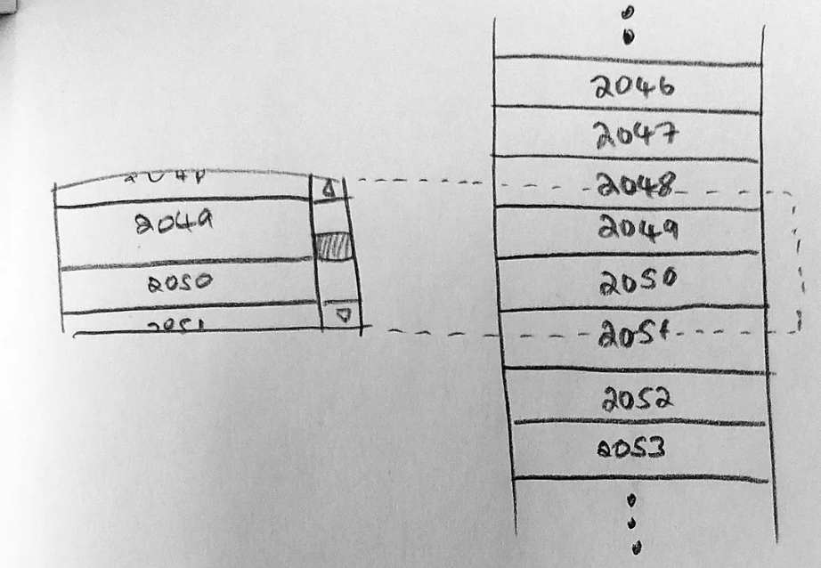
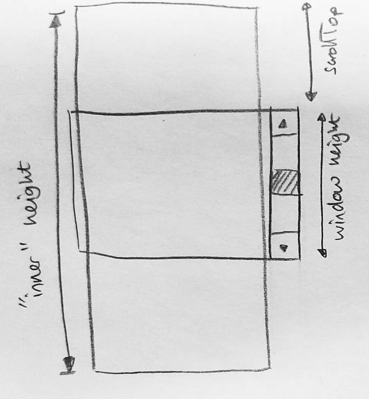

# Employee Dashboard - Internship Assignment

## Candidate Details
- Name: Abhijeet Singh Rajput
- Institute: IIT Dhanbad
- Program: B.Tech

## Project Overview
This is a frontend Employee Dashboard built with Next.js and React. The app focuses on practical UI development tasks such as list rendering, analytics views, profile details, and browser API usage.

## Tech Stack
- Next.js
- React
- Tailwind CSS
- Axios
- Leaflet / React Leaflet

## Main Features
- Employee list view
- Employee detail pages
- Analytics dashboard
- Camera capture integration
- Signature capture
- Virtualized list component for scalable rendering

## Technical Explanation: Virtualization Math
The `VirtualizedList` component renders only the visible rows based on scroll position, instead of rendering all rows at once.

### Variables
- `numItems`: total number of rows
- `itemHeight`: fixed height of each row (in px)
- `windowHeight`: visible viewport height (in px)
- `scrollTop`: current vertical scroll offset (in px)

### Core Math
1. Total scrollable height:

```js
innerHeight = numItems * itemHeight;
```

2. First visible row index:

```js
startIndex = Math.floor(scrollTop / itemHeight);
```

3. Last visible row index:

```js
endIndex = Math.min(
	numItems - 1,
	Math.floor((scrollTop + windowHeight) / itemHeight)
);
```

4. Absolute Y-position of each rendered row:

```js
top = index * itemHeight;
```

### Why This Works
- The outer container scrolls normally.
- The inner container keeps full logical height (`innerHeight`) so the scrollbar behaves like a full list.
- Only rows from `startIndex` to `endIndex` are mounted.
- Each mounted row is absolutely positioned at its exact Y coordinate.

This reduces DOM nodes and improves rendering performance for large datasets.

### Diagrams




## Run Locally
1. Install dependencies:

```bash
npm install
```

2. Start the development server:

```bash
npm run dev
```

3. Open http://localhost:3000 in your browser.

## Intentional Bug: Camera Stream Memory Leak
The camera stream started using `navigator.mediaDevices.getUserMedia()` is not cleaned up when the component unmounts or when the user retakes the photo.

```js
const stream = await navigator.mediaDevices.getUserMedia({ video: true });
videoRef.current.srcObject = stream;
```

Normally, the stream tracks should be stopped during cleanup:

```js
const stream = videoRef.current.srcObject;
stream.getTracks().forEach((track) => track.stop());
```

This cleanup is intentionally omitted in the assignment build. Because of that, if the camera is started multiple times, hardware and browser resources may remain active in the background.

## Why This Bug Was Chosen
- It is directly related to browser hardware APIs.
- It is realistic and commonly seen in real-world apps.
- The app continues to function, so the demo remains stable.
- It is easy to explain clearly in a short interview/demo video.

## Notes for Reviewer
This bug is intentional to demonstrate awareness of resource lifecycle management when working with browser APIs.
